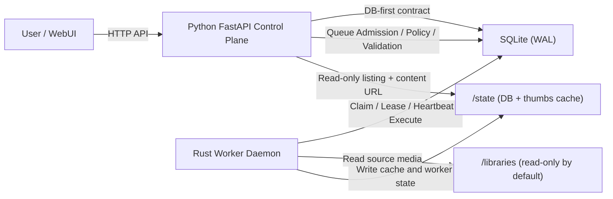

# DedupFS Architecture

[English](./ARCHITECTURE.md) | [简体中文](./ARCHITECTURE.zh-CN.md)

## 1. Scope

This document describes the runtime architecture of DedupFS after M4 hardening:
- Python control plane + Rust data plane
- DB-first cross-language contract
- deterministic hash-only dedup semantics
- thumbnail system as UI-only data product
- M5 duplicate-group read APIs with keyset pagination

## 2. High-Level Topology

## 3. Responsibility Boundaries

| Layer | Owns | Must Not Own |
|---|---|---|
| Python control plane | API boundary, policy enforcement, job admission, path policy, stale recovery APIs, cleanup scheduling, maintenance policy endpoints | Heavy scan/hash execution, blocking thumbnail rendering in request handlers |
| Rust data plane | Scan/hash execution, thumbnail generation, thumbnail cleanup execution, WAL checkpoint execution, lease heartbeat, global thumbnail I/O budget reservation | Delete/trash decisions, dedup semantic changes, similarity/heuristic logic |
| SQLite protocol DB | Source of truth for state machine, lease fields, progress, retry metadata, audit-oriented transitions | Business policy inference |

## 4. Data Flows

### 4.1 Scan/Hash flow

1. Python creates scan/hash jobs in DB.
2. Rust daemon claims one runnable scan/hash job.
3. Rust executes streamed scan/chunked hashing and writes progress.
4. Rust marks completion/failure; stale running jobs are recoverable via lease protocol.

### 4.2 Thumbnail flow

1. Python validates path/media type and performs atomic queue admission.
2. Rust claims thumbnail tasks by lease and media-type concurrency budget.
3. Rust generates image/video thumbnails to `/state/thumbs` only.
4. Rust persists success/failure metadata (`error_code`, `error_message`, `retry_after`).

### 4.3 Group cleanup flow

1. Python schedules cleanup job by `group_key`.
2. Rust claims cleanup only when the group has no active (`pending/running`) thumbnail rows.
3. Rust removes only terminal thumbnail cache artifacts and terminal thumbnail rows.

### 4.4 Duplicate browsing flow

1. Python serves duplicate-group listing from grouped `library_files` rows.
2. Duplicate groups are paged by keyset cursor; no full in-memory materialization.
3. Python serves group-file listing by `group_key` with deterministic `id` keyset pagination.
4. Web UI consumes these APIs with client-side virtualization and lazy thumbnail requests (`/api/v1/thumbs/request`).

### 4.5 WAL maintenance flow

1. Python receives maintenance request and applies policy (mode allowlist, truncate guard, min interval).
2. Python enqueues one WAL maintenance row (`wal_maintenance_jobs`) with `pending` status.
3. Rust daemon claims due WAL rows with lease ownership (`worker_id`, heartbeat, lease expiry).
4. Rust executes `PRAGMA wal_checkpoint(mode)` and persists checkpoint stats.
5. Rust finalizes row as `completed`, `retryable` (busy checkpoint), or `failed`.

## 5. Safety Boundaries

- Dedup semantics: duplicates are equal by full-file hash only.
- No similarity logic is allowed anywhere.
- Rust never performs original-media delete/move decisions.
- Source path must validate under `/libraries/*` (relative path + realpath/prefix checks).
- Thumbnail output must stay under `/state/thumbs`.
- Cleanup must not mutate original media files.

## 6. Concurrency and Liveness Model

- Scan/hash global mutex is enforced by DB invariant (single active `pending/running` scan/hash row).
- Thumbnail generation concurrency is bounded by separate image/video limits.
- All running work uses lease fields:
  - `worker_id`
  - `worker_heartbeat_at`
  - `lease_expires_at`
- Stale lease rows are deterministically recovered by protocol paths.
- Daemon idle loop uses bounded backoff with jitter.

## 7. Performance Controls

- Streaming file traversal and chunked hashing in Rust.
- Batch-oriented DB writes for scan/hash pipelines.
- Atomic thumbnail queue backpressure admission in Python.
- DB-backed global thumbnail I/O reservation (`io_rate_limits`) in Rust.
- Python policy + Rust execution split for WAL checkpoint governance.
- SQLite runs in WAL mode; schema indexes target queue/lease/pagination paths.
- Duplicate-group listing uses DB aggregation over indexed hash columns (`ix_library_files_dedup_group`).

## 8. Observability and Operations

- Thumbnail operational endpoint:
  - `GET /api/v1/thumbs/metrics`
- WAL maintenance operational endpoints:
  - `POST /api/v1/maintenance/wal/checkpoint`
  - `GET /api/v1/maintenance/wal/checkpoint/latest`
  - `GET /api/v1/maintenance/wal/metrics`
- Tracks queue depth, retry backlog, cleanup lag.
- Failure metadata is persisted for audit and retry governance.
- UI endpoints:
  - `GET /ui`
  - `GET /ui/static/*`

## 9. Evolution Rules

- Policy and semantics changes remain control-plane concerns.
- Data-plane expansion is allowed for execution performance only.
- Any feature that changes dedup definition or introduces heuristic decisions is out of scope.
