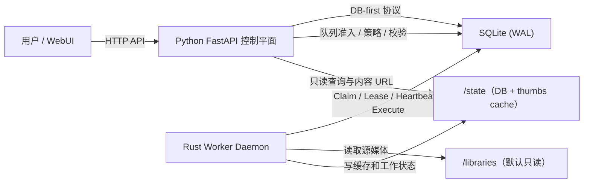

# DedupFS 架构说明

[English](./ARCHITECTURE.md) | [简体中文](./ARCHITECTURE.zh-CN.md)

## 1. 范围

本文描述 M4 加固后的 DedupFS 运行时架构：
- Python 控制平面 + Rust 数据平面
- DB-first 跨语言协作协议
- 仅 hash 的确定性去重语义
- 缩略图系统仅作为 UI 展示数据面
- M5 重复组只读分页 API（keyset）

## 2. 高层拓扑

## 3. 职责边界

| 层 | 负责 | 不负责 |
|---|---|---|
| Python 控制平面 | API 边界、策略执行、任务准入、路径策略、stale 恢复接口、清理调度、维护策略端点 | 重 scan/hash 执行、请求线程内阻塞式缩略图渲染 |
| Rust 数据平面 | scan/hash 执行、缩略图生成、缩略图清理执行、WAL checkpoint 执行、租约续约、全局缩略图 I/O 预算预留 | 删除/回收站决策、去重语义变更、相似度/启发式逻辑 |
| SQLite 协议库 | 状态机、租约字段、进度、重试元数据、可审计状态迁移的事实源 | 业务策略推断 |

## 4. 数据流

### 4.1 Scan/Hash 流程

1. Python 在 DB 中创建 scan/hash 任务。
2. Rust daemon claim 可运行 scan/hash 任务。
3. Rust 执行流式扫描/分块 hash 并持续写入进度。
4. Rust 写入完成/失败状态；租约过期任务可通过协议路径恢复。

### 4.2 缩略图流程

1. Python 做路径/媒体类型校验，并执行原子化队列准入。
2. Rust 按租约和媒体类型并发预算 claim 缩略图任务。
3. Rust 仅向 `/state/thumbs` 生成图片/视频缩略图。
4. Rust 持久化成功/失败元数据（`error_code`、`error_message`、`retry_after`）。

### 4.3 分组清理流程

1. Python 按 `group_key` 调度清理任务。
2. Rust 仅在该组不存在 active（`pending/running`）缩略图行时 claim 清理任务。
3. Rust 仅删除终态缩略图缓存与终态缩略图索引行。

### 4.4 重复组浏览流程

1. Python 从 `library_files` 聚合结果提供重复组列表接口。
2. 重复组列表使用 keyset 游标分页，避免全量内存物化。
3. Python 按 `group_key` 提供组内文件列表，并以 `id` keyset 分页保证确定性。
4. WebUI 消费上述 API，在前端执行列表虚拟化并懒请求缩略图（`/api/v1/thumbs/request`）。

### 4.5 WAL 维护流程

1. Python 接收维护请求并执行策略校验（模式白名单、truncate 开关、最小间隔）。
2. Python 将 WAL 维护任务写入 `wal_maintenance_jobs`（`pending`）。
3. Rust daemon 按租约字段（`worker_id`、heartbeat、lease）claim 到期 WAL 任务。
4. Rust 执行 `PRAGMA wal_checkpoint(mode)` 并持久化 checkpoint 统计信息。
5. Rust 将任务置为 `completed`、`retryable`（busy）或 `failed`。

## 5. 安全边界

- 去重语义：重复仅由全文件 hash 相等定义。
- 全系统禁止引入相似度逻辑。
- Rust 不得进行原始媒体删除/移动决策。
- 源路径必须通过 `/libraries/*` 校验（相对路径 + realpath/prefix）。
- 缩略图输出必须位于 `/state/thumbs` 下。
- 清理不得修改原始媒体文件。

## 6. 并发与存活模型

- scan/hash 全局互斥由 DB 不变量保证（同一时刻仅一个 active `pending/running`）。
- 缩略图执行按 image/video 分别限并发。
- 运行中任务统一使用租约字段：
  - `worker_id`
  - `worker_heartbeat_at`
  - `lease_expires_at`
- stale 租约行通过协议路径确定性恢复。
- daemon 空闲轮询采用有界退避 + 抖动。

## 7. 性能控制

- Rust 侧流式遍历与分块 hash。
- scan/hash 路径采用批量写库策略。
- Python 侧缩略图队列准入为原子背压。
- Rust 侧使用 DB 全局 I/O 预算预留（`io_rate_limits`）。
- WAL 治理采用 Python 策略 + Rust 执行分层。
- SQLite 使用 WAL；索引覆盖队列、租约、分页关键路径。
- 重复组查询依赖 hash 聚合索引（`ix_library_files_dedup_group`）以支撑规模化浏览。

## 8. 可观测性与运维

- 缩略图运维指标端点：
  - `GET /api/v1/thumbs/metrics`
- WAL 维护运维端点：
  - `POST /api/v1/maintenance/wal/checkpoint`
  - `GET /api/v1/maintenance/wal/checkpoint/latest`
  - `GET /api/v1/maintenance/wal/metrics`
- 指标包含队列深度、重试积压、清理延迟。
- 失败元数据持久化，支持审计与重试治理。
- WebUI 端点：
  - `GET /ui`
  - `GET /ui/static/*`

## 9. 演进规则

- 策略与语义变更继续由控制平面主导。
- 数据平面可扩展范围仅限执行性能。
- 任何改变去重定义或引入启发式判断的功能均不在允许范围内。
